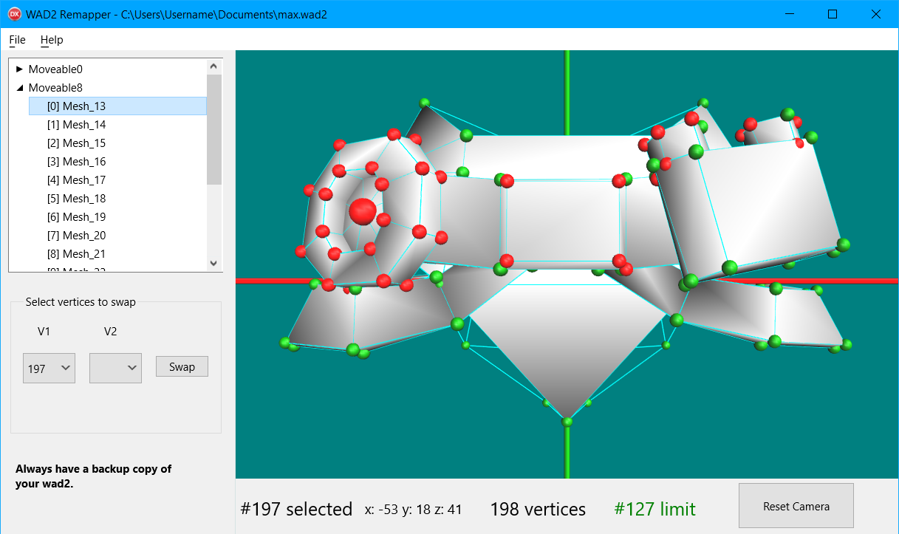

# WAD2 Remapper
A program for the Tomb Raider Level Editor (TRLE) community.

The Wadtool program included with Tomb Editor does not yet have a remap feature.

This program allows remapping outfits for the WAD2 format.

For an outfit to join properly in game, the vertices (points) that connect to a joint mesh must be remapped to an index equal or less than a certain number (limit).

Vertices that meet this requirement are shown green. Vertices that are above the limit are shown red.

https://github.com/MontyTRC89/Tomb-Editor-Public

This is a Delphi 10.3.3 Firemonkey (FMX) 3D project.

Delphi 10 Community Edition is currently available for free.
https://www.embarcadero.com/products/delphi/starter

## Download
https://github.com/sapper-trle/WAD2Remapper/releases/latest Windows 64 bit

## Usage:

### WARNING: Use this program only on a copy of your wad2. The wad2 file format is easily corrupted.

Open your wad2.

Expand a moveable in the treeview.

Select a mesh.

Swap vertices as required.

There are two ways to swap vertices.

1) Left click a vertex to select it and then hold "Control" and left click on
   another vertex to swap them.

2) Enter the two vertex numbers to swap in the boxes and click "Swap".

Save the wad2.

## 3D Viewport Controls.

Left mouse button - Select vertex

Right mouse button - Rotate view

Middle mouse button - Pan view

Mouse wheel - Zoom view

Note that sometimes you might click through a mesh and select the vertex hidden
behind the mesh.

